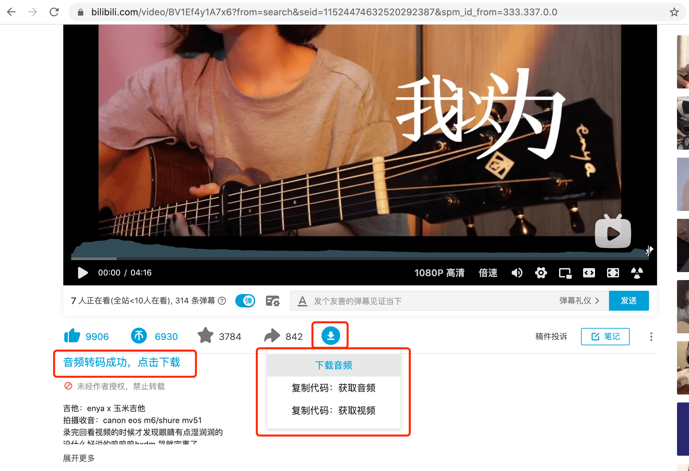
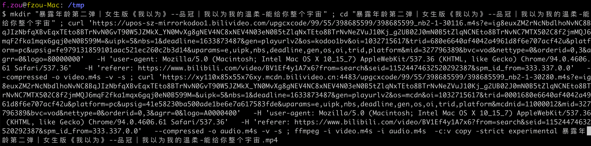

# bilibili-downloader
哔哩哔哩（b站）音视频下载脚本

该脚本可运行在油猴插件。若你未安装，可访问 <a href="https://www.tampermonkey.net/" target="_blank">油猴官网</a> 下载安装。当然，该脚本也可以运行在类似油猴的浏览器插件中。甚至，你可以直接将该脚本粘贴到浏览器控制台运行。

## Alternative
你也可以用我的另一个开源项目来下载b站视频 https://github.com/foamzou/media-get

## 用途
有时候，我们在 b站 听到喜欢的歌（或视频），希望将其下载到自己的音乐播放器，方便下次听。

但 b站 的音视频是分离的 m4s 格式的文件，我们可以通过分析网络请求，将这两个 m4s 文件下载到本地，再用 ffmpeg 转换成 mp4 或 mp3。但每次都这样操作，过于繁琐。

因此，该脚本将上述步骤自动化了。

## 安装|更新
点击 <a href="https://github.com/foamzou/bilibili-downloader/raw/main/index.user.js" target="_blank">这里</a> 安装或更新

## 功能
本脚本会在视频页插入一个下载图标的按钮，光标移动到该按钮，会有三个选项：
- 下载音频
    - 该选项将向我的服务器提交请求，由我的服务下载音频并转码为 mp3 文件后，将下载地址赋值到链接。然后你可以点击"音频转码成功，点击下载"
    - 支持指定音频的开始时间和结束时间，可以只下载你需要的片段
    - 带宽有限，就不提供视频下载了，推荐使用下边的本地下载方式。
    - 服务端的核心代码和下边的代码是一样的，本仓库就不提供了。
- 复制代码：获取音频
    - 该方式需要你机器安装了 ffmpeg
    - 目前只支持 shell。由于时间有限，Windows的cmd或powershell 暂时不支持，有感兴趣的朋友可以帮忙提 PR。
    - 支持指定音频的开始时间和结束时间，生成的命令会包含相应的时间裁剪参数
    - 由于我的小破站只有 1M 带宽，下载会比较慢。因此推荐你使用这种方式进行下载。点击该选项后，本脚本会将下载音频和转码音频的命令放到系统剪贴板。你可以粘贴到你本地机器运行。
- 复制代码：获取视频
    - 说明同上

### 时间裁剪功能
在下拉菜单中提供了两个输入框：
- 开始时间：指定音频开始的时间点
- 结束时间：指定音频结束的时间点

时间格式支持：
- HH:MM:SS 格式，如 "01:30:45"（1小时30分45秒）
- MM:SS 格式，如 "05:30"（5分30秒）
- SS 格式，如 "90"（90秒）

注意：
- 开始时间和结束时间可以只填写其中一个
- 如果不填写时间，则处理整个音频
- 目前只对本地下载命令行生成有效，直接点击“下载音频”按钮，不会生成时间裁剪参数，依旧下载全量音频

## 截图
UI

命令行

